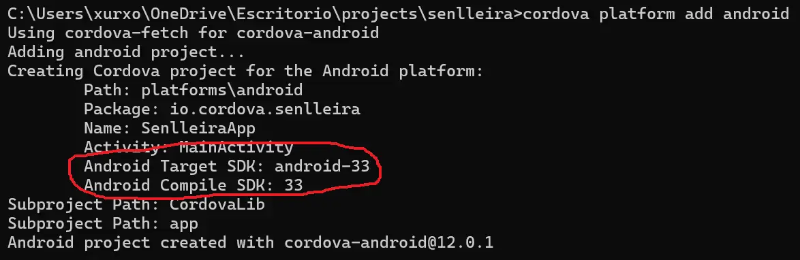
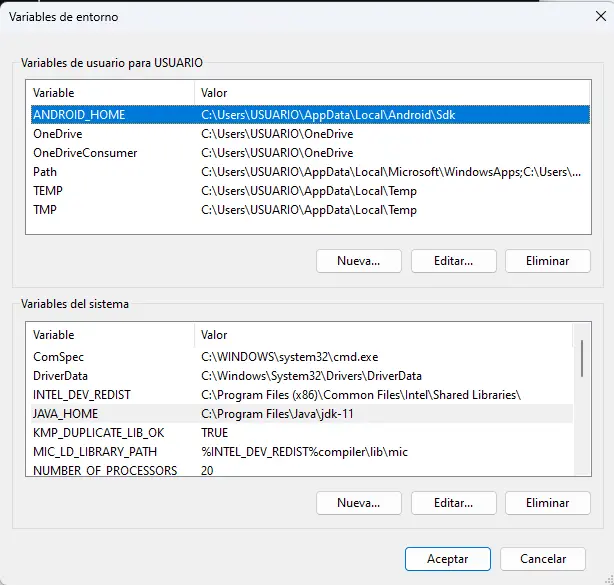
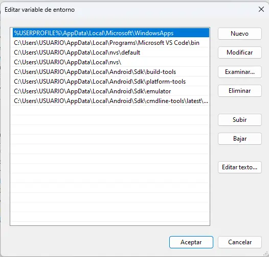
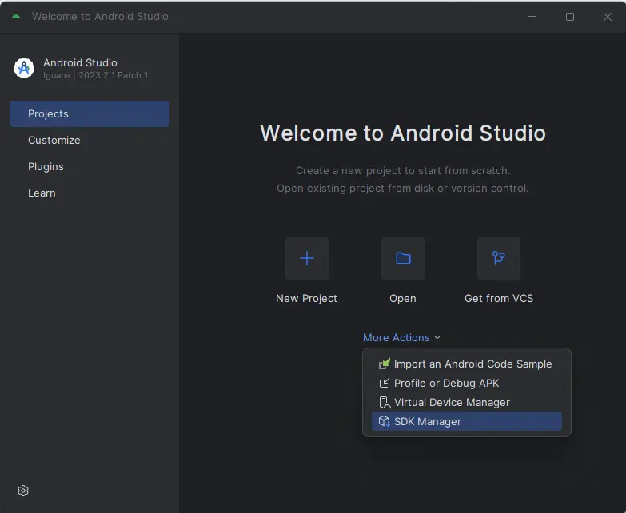

# senlleirapp

**Lenguaje:** Vue 3

## Enlaces

1. Cordova
  - [Cordova cli](https://cordova.apache.org/docs/en/12.x/guide/cli/index.html)
  - [Android](https://cordova.apache.org/docs/en/12.x/guide/platforms/android/index.html)
  - [Requirimientos para Android](https://cordova.apache.org/docs/en/12.x/guide/platforms/android/index.html#requirements-and-support)
2. [Google Play Console](https://play.google.com/console/)

## Cordova. Generar una aplicación Android desde ficheros estáticos

Trabajamos con la plataforma de [Cordova Apache](https://cordova.apache.org/)

A fecha actual para instalar **Cordova** de forma global

```sh
npm install -g cordova
```

Creamos proyecto:

```sh
cordova create senlleira io.cordova.senlleira SenlleiraApp
```

Añadimos la plataforma

```sh
cd senlleira
cordova platform add android
```

Podemos ver el resultado del anterior comando en la imagen inferior. Resaltado en rojo el nivel de la API de **Android**. Importante para la instalación del **SDK** en **Android Studio** en el futuro.



En la tabla inferior fue obtenida de [Android Platform Guide](https://cordova.apache.org/docs/en/12.x/guide/platforms/android/index.html)

| cordova-android version | Android API-Levels (Android Version) | Library & Tooling Version |
| ----------------------- | ------------------------------------ | ------------------------- |
| 12.0.x                  | 24 (7.0) - 33 (13.0)                 | Build Tools: ^33.0.2<br>Kotlin: 1.7.21<br>Gradle: 7.6<br>Android Gradle Plugin: 7.4.2<br>AndroidX Compat Library: 1.6.1<br>AndroidX WebKit Library: 1.6.0<br>AndroidX Core SplashScreen: 1.0.0<br>Google Services Gradle Plugin: 4.3.15      |

### Requisitos tras añadir la plataforma

Dependiendo de lo que tengamos instalado en nuestro equipo puede ser necesario realizar ciertas configuraciones (e.g configurar variables de entorno) o instalaciones. Esta información la podemos ver con el siguiente comando:

```sh
cordova requirements
```

Si hay errores suelen mostrarse como vemos en la imagen que viene a continuación:


### Configuraciones adicionales

#### JDK

[Documentación de Cordova sobre JDK](https://cordova.apache.org/docs/en/12.x/guide/platforms/android/index.html#java-development-kit-jdk)

>**Java Development Kit (JDK)** <br>If you are using cordova-android 10.0.0 or greater, install the [Java Development Kit (JDK) 11](https://www.oracle.com/java/technologies/downloads/#java11).
>If you are using any version below cordova-android 10.0.0, install the Java Development Kit (JDK) 8.<br>The JAVA_HOME environment variable must be set according to your JDK installation path. See the Setting Environment Variables section on how to set up environment variables. Alternatively as of cordova-android 10.0.0 or greater, CORDOVA_JAVA_HOME can be set in place of JAVA_HOME, allowing a JDK install to be used specifically for Cordova development.

#### Gradle

[Documentación de Cordova sobre Gradle](https://cordova.apache.org/docs/en/12.x/guide/platforms/android/index.html#gradle)

>As of Cordova-Android 6.4.0, [Gradle](https://gradle.org/install/) is required to be installed.<br>When installing on Windows, you need to add the path to the Gradle's binary directory to your path environment variable. See [Setting Environment Variables](https://cordova.apache.org/docs/en/12.x/guide/platforms/android/index.html#setting-environment-variables)) on how to configure system environment variables.

En la captura de abajo entre otras cosas vemos los errores de la falta de **Gradle**.


#### Android Studio

[Documentación de Cordova sobre Android Studio](https://cordova.apache.org/docs/en/12.x/guide/platforms/android/index.html#android-studio)

>Download and install [Android Studio](https://developer.android.com/studio?hl=es-419). Follow the instructions at the linked Android Developer site to get started.

### Variables de entorno

[Documentación de Cordova sobre las variables de entorno](https://cordova.apache.org/docs/en/12.x/guide/platforms/android/index.html#setting-environment-variables)

#### JAVA_HOME y ANDROID_HOME

A modo de ejemplo:



#### Path

A modo de ejemplo



Recuerda instalar todos los **Sdk tools** para poder ponerlas en tu variable de entorno path



# Errores

Hay errores que me aparecieron cuando emulé la generación del fichero **apk**

## UnsupportedClassVersionError

```sh
cordova run --emulate
```

>java.lang.UnsupportedClassVersionError: 
com/android/sdklib/tool/sdkmanager/SdkManagerCli has been compiled 
by a more recent version of the Java Runtime (class file version 61.0), 
this version of the Java Runtime only recognizes class file versions up to 55.0

[Solución: Rename the 8.0 folder to latest in C:\Users\<USER_NAME>\AppData\Local\Android\Sdk\cmdline-tools](https://stackoverflow.com/questions/76882205/error-linkageerror-occurred-while-loading-main-class-com-android-sdklib-tool-sd)

# Una vez generados al app

1. **NO OLVIDES SUBIR LOS ESTÁTICOS A LA CARPETA www LOS ESTÁTICOS**
2. Abrir la carpeta /plataforms/android en **Android Studio**
3. Completa las opciones del menú Build
