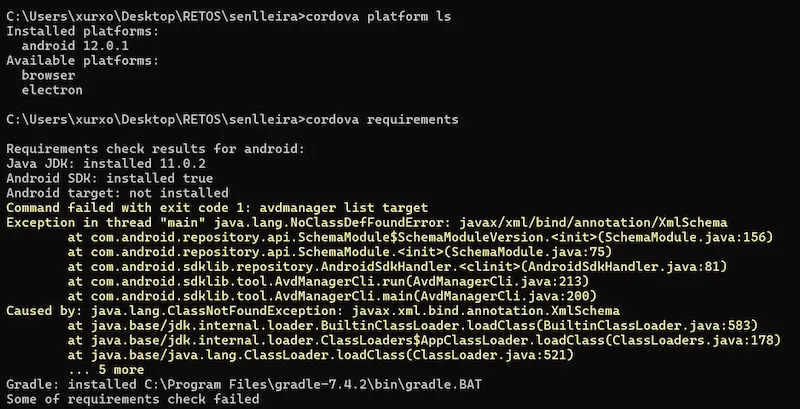
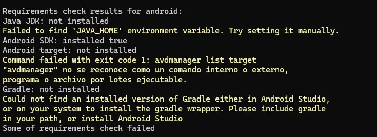

# senlleirapp

This template should help get you started developing with Vue 3 in Vite.

## Configuración para utilizar en Android

## Cordova

Trabajamos con la plataforma de [Córdova Apache](https://cordova.apache.org/)

A fecha actual para instalar córdova de forma global

```sh
npm install -g cordova
```

Algunos links:

1. [Cordova cli](https://cordova.apache.org/docs/en/12.x/guide/cli/index.html)
2. [Android](https://cordova.apache.org/docs/en/12.x/guide/platforms/android/index.html)
3. [Requirimientos para Android](https://cordova.apache.org/docs/en/12.x/guide/platforms/android/index.html#requirements-and-support)

```sh
cordova create senlleira io.cordova.senlleira SenlleiraApp
```

Añadimos la plataforma

```sh
cd senlleira
cordova platform add android
```

También podemos ver si reunimos los prerequisitos. con el comando <code>cordova requirements</code>



### Posibles errores de _cordova requirements_

#### JDK

- [Instalar JDK](https://www.oracle.com/java/technologies/downloads/)

#### Gradle

En la capturar de abajo entre otras cosas vemos los errores de la falta de **Gradle**.



- [Instalar Gradle](https://gradle.org/install/)


### Producción en browser

1. Crear los estáticos para producción

```sh
npm run build
```